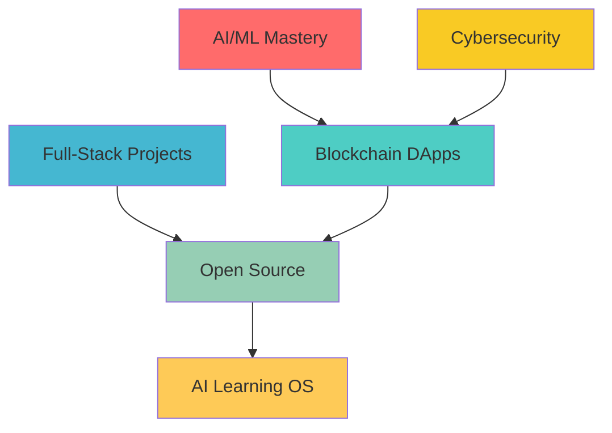

<div align="center">

# 🚀 EVIN JACOB SUBIN

### 『 Full-Stack Architect • Blockchain Visionary • AI Trailblazer 』


[](https://evin-jacob-subin.vercel.app)
[](mailto:youridertech@gmail.com)
[](https://instagram.com/e_v_i_n_j_s_u_b_i_n)
[](https://linkedin.com/in/evinjsubin)

</div>

---


## 💫 About Me

```typescript
const evin = {
    pronouns: "he/him",
    role: "Full-Stack Architect & Tech Visionary",
    age: "Grade 10 Student",
    location: "🇮🇳 Kerala, India",
    currently: "Architecting THE COMEBACK",
    passions: ["AI/ML", "Blockchain", "Web3", "Cybersecurity"],
    learning: [".NET", "Cryptography", "Smart Contracts"],
    dream: "AI-Powered Learning OS",
    philosophy: "Code creates impact. Innovation changes the world."
};
```

### 🎯 Current Mission
- 🔭 Leading **[THE COMEBACK](https://github.com/EVINJSUBIN/THECOMEBACK)** - Revolutionizing [tech space]
- 🌱 Mastering **AI + Blockchain** at their intersection
- 🎓 Grade 10 while building production-grade systems
- 🔮 Diving deep into **Ethical Hacking** & **Zero-Knowledge Proofs**

### 📚 Inspiration
> *"Stay hungry, stay foolish."* — Steve Jobs

**Currently Reading:** Steve Jobs Biography | Zero to One | Clean Code

---

## 🛠️ Tech Stack

### 💻 Languages & Frameworks
<div align="center">


</div>

### 🌐 Full-Stack
<div align="center">


</div>

### 🚀 Emerging Tech
<div align="center">


</div>

---

## 📊 GitHub Analytics

<div align="center">
  
  
</div>

<div align="center">
  
  
</div>

---

## 🔥 Featured Projects

<div align="center">

[](https://github.com/EVINJSUBIN/THECOMEBACK)

[](https://evin-jacob-subin.vercel.app)

</div>

---

## 🌟 2026 Roadmap



---

## 💡 From the Dev Mind

<div align="center">

</div>

---

## 📈 Activity Snapshot

<div align="center">
[](https://github.com/evinjsubin)
</div>

---

<div align="center">

### 💭 *"The best way to predict the future is to invent it."* — Alan Kay


**Let's build the future together! 🚀**

[](https://www.buymeacoffee.com/evinjsubin)

</div>
