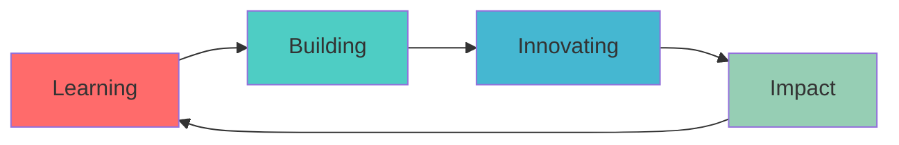

<div align="center">

# 🚀 EVIN SUBIN

### 『 Full-Stack Architect • Blockchain Enthusiast • AI Pioneer 』


[](https://memory-of-thressia-varkey.web.app/)
[](mailto:youridertech@gmail.com)
[](https://instagram.com/e_v_i_n_j_s_u_b_i_n)

</div>

---


## 💫 About Me

```typescript
const evin = {
    role: "Full-Stack Developer & Tech Visionary",
    age: "Grade 10 Student",
    location: "Kerala, India 🇮🇳",
    currentFocus: ["AI Development", "Blockchain", "Web3"],
    learning: ["Cybersecurity", "Cryptography", ".NET Framework"],
    currentProject: "THE COMEBACK",
    dreamProject: "AI-Powered Learning Operating System",
    philosophy: "Innovation through Code, Impact through Technology"
};
```

### 🎯 Current Mission
- 🔭 Architecting **[THE COMEBACK](https://github.com/EVINJSUBIN/THECOMEBACK)** - A Revolutionary Project
- 🌱 Mastering the intersection of **AI, Blockchain & Full-Stack Development**
- 🎓 Balancing academics with real-world software engineering
- 🔮 Exploring **Ethical Hacking**, **Smart Contracts**, and **Decentralized Systems**

### 📚 Favorite Reads
> *"Stay hungry, stay foolish"* - Steve Jobs

- 📖 Harry Potter Series (The Magic of Storytelling)
- 📖 Steve Jobs Biography (Innovation & Vision)
- 📖 Various Autobiographies (Learning from Giants)

---

## 🛠️ Tech Arsenal

### 💻 Languages


### 🎨 Frontend


### ⚙️ Backend & Tools


### 🎮 Game Dev & Advanced


---

## 📊 GitHub Analytics

<div align="center">
  
  
</div>

<div align="center">
  
</div>

<div align="center">
  
</div>

---

## 🔥 Featured Projects

<div align="center">

[](https://github.com/EVINJSUBIN/THECOMEBACK)

</div>

---

## 🌟 Current Goals



- 🎯 Master AI/ML algorithms and implementation
- 🔐 Deep dive into cybersecurity and ethical hacking
- ⛓️ Build decentralized applications on blockchain
- 🌐 Create an AI-powered learning platform
- 📱 Develop cross-platform mobile applications
- 🤝 Contribute to major open-source projects

---

## 💡 Random Dev Quote

<div align="center">


</div>

---

## 📈 Contribution Graph

<div align="center">

[](https://github.com/evinjsubin)

</div>

---

<div align="center">

### 💭 "The best way to predict the future is to invent it." - Alan Kay

### 🤝 Let's Connect and Build Something Amazing!


**Thanks for visiting! Feel free to reach out for collaborations or just a tech chat! 🚀**

[](https://www.buymeacoffee.com)

</div>
