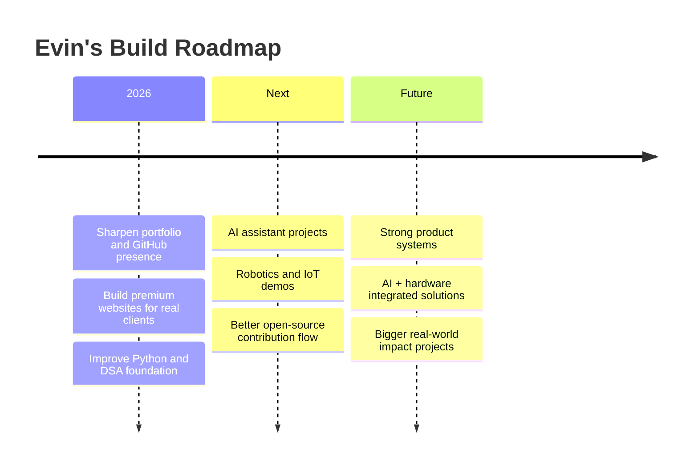

<div align="center">


<br />


<br />

[](https://evin-jacob-subin.vercel.app/)
[](https://github.com/EVINJSUBIN)
[](https://instagram.com/e_v_i_n_j_s_u_b_i_n)
[](mailto:evinjsubin@gmail.com)

<br />


</div>

---

<div align="center">

### `SYSTEM BOOT / KERALA / INDIA / 2026`

</div>

```txt
┌──────────────────────────────────────────────────────────────────────────────┐
│  NAME        : Evin Jacob Subin                                               │
│  SIGNAL      : Student Developer / Full-Stack Builder                         │
│  BASE        : Kerala, India                                                  │
│  STYLE       : Dark Retro + Poster UI + Clean Engineering                     │
│  LANES       : Premium Web • AI Interfaces • Robotics / IoT • Product Demos   │
│  MISSION     : Build things that look sharp, work fast, and solve real needs. │
└──────────────────────────────────────────────────────────────────────────────┘
```

---

##  Hey, I’m Evin

I’m **Evin Jacob Subin**, a Grade 10 builder from Kerala who loves turning ideas into **premium websites, AI-powered interfaces, hardware demos, and real-world prototypes**.

I do not want my projects to feel like plain templates.  
I like building things that have a **poster-grade first impression**, smooth interaction, fast performance, and a real working system behind the design.

> **Web × AI × Robotics** — that is the zone I’m building in.

---

## 🎛️ Build Lanes

<table>
<tr>
<td width="50%" valign="top">

### 01 / Premium Web

I build modern websites that feel like launch posters, not boring pages.

**Focus**
- Business portfolios
- Landing pages
- Product websites
- Mobile-first interfaces
- Strong visual identity

**Stack**
`Next.js` `React` `Tailwind CSS` `Framer Motion` `Vercel`

</td>
<td width="50%" valign="top">

### 02 / AI Interfaces

I like creating AI tools that feel useful, simple, and demo-ready.

**Focus**
- AI assistants
- OCR workflows
- Voice-based ideas
- Prompt systems
- RAG concepts

**Stack**
`Python` `APIs` `LLMs` `Whisper` `Node.js` `Django`

</td>
</tr>
<tr>
<td width="50%" valign="top">

### 03 / Robotics & IoT

I experiment with hardware, sensors, and physical computing.

**Focus**
- Arduino builds
- ESP32 projects
- Sensors
- Automation
- Robotics prototypes

**Stack**
`Arduino` `MicroPython` `ESP32` `C/C++` `IoT`

</td>
<td width="50%" valign="top">

### 04 / Spireclub Direction

I’m building a premium web agency direction for local Kerala businesses.

**Focus**
- Local business websites
- Better digital presence
- Client-ready demos
- Simple, elegant websites
- Conversion-focused design

**Stack**
`Next.js` `Tailwind` `Vercel` `Cloudflare` `SEO Basics`

</td>
</tr>
</table>

---

## 🧠 Developer Identity

```ts
const evinJacobSubin = {
  name: "Evin Jacob Subin",
  location: "Kerala, India",
  role: "Student Developer",
  grade: "10",
  buildStyle: "dark retro, poster-grade, fast and accessible",
  mainFocus: [
    "Premium Web Experiences",
    "AI Interfaces",
    "Robotics & IoT",
    "Useful Product Demos"
  ],
  mindset: "learn fast, build real, polish hard",
  currentEnergy: "turning ideas into projects people remember"
};
```

---

## 🧰 Tech Stack

<div align="center">

### Core Languages


### Web & UI


### Backend, Data & Tools


</div>

---

## 🕹️ Current Focus Board

<table>
<tr>
<td width="33%" valign="top">

### Building

- Portfolio systems
- Local business websites
- AI assistant demos
- UI experiments
- Robotics concepts

</td>
<td width="33%" valign="top">

### Learning

- Advanced Python
- Data structures
- Machine learning basics
- Backend architecture
- Cybersecurity fundamentals

</td>
<td width="33%" valign="top">

### Improving

- Clean code
- Better UI structure
- GitHub workflow
- Project documentation
- Real client delivery

</td>
</tr>
</table>

---

## 🚀 Featured Project Zones

> Replace the placeholders with your best live repos as you publish more work.

<table>
<tr>
<td width="50%" valign="top">

### 🟡 Retro Portfolio System

A dark retro portfolio with huge typography, paper texture, clean motion, and strong first impression.

**Type:** Personal Brand / Portfolio  
**Stack:** `Next.js` `Tailwind CSS` `Framer Motion` `Vercel`

[View Portfolio →](https://evin-jacob-subin.vercel.app/)

</td>
<td width="50%" valign="top">

### ⚡ Spireclub

A premium web direction for Kerala local businesses that need sharper digital presence and better trust online.

**Type:** Web Agency / Client Websites  
**Stack:** `Next.js` `Tailwind CSS` `Vercel` `SEO`

[Add Live Link →](https://github.com/EVINJSUBIN)

</td>
</tr>
<tr>
<td width="50%" valign="top">

### 🤖 AI Interface Experiments

Assistant flows, OCR ideas, voice workflows, and AI-powered tools focused on usability.

**Type:** AI / Productivity / Demo Systems  
**Stack:** `Python` `Node.js` `Django` `LLMs`

[Add Repo →](https://github.com/EVINJSUBIN?tab=repositories)

</td>
<td width="50%" valign="top">

### 🔧 Hardware Lab

Arduino, ESP32, sensors, IoT, and robotics experiments that connect software with the physical world.

**Type:** Robotics / IoT / Hardware  
**Stack:** `Arduino` `MicroPython` `C/C++` `ESP32`

[Add Repo →](https://github.com/EVINJSUBIN?tab=repositories)

</td>
</tr>
</table>

---

## 📊 GitHub Pulse

<div align="center">


<br /><br />


<br /><br />


</div>

---

## 🧩 How I Like to Build

```txt
IDEA
  ↓
Sketch the flow
  ↓
Build the working version
  ↓
Make it responsive
  ↓
Add motion and identity
  ↓
Test the real user path
  ↓
Ship, improve, repeat
```

### My build rules

- **First impression matters** — the design should make people stop.
- **Function comes first** — the project should actually work.
- **Mobile-first always** — most people see the project on phone.
- **Keep it fast** — no heavy design if it ruins the experience.
- **Make it explainable** — a good project should be easy to present.

---

## 🗺️ Roadmap



---

## 🏷️ Quick Tags

<div align="center">

`student developer` • `kerala builder` • `web developer` • `ai interfaces` • `robotics` • `iot` • `arduino` • `python` • `next.js` • `poster-grade ui` • `retro web`

</div>

---

## 📬 Contact

<div align="center">

### Let’s build something people remember.

[](https://evin-jacob-subin.vercel.app/)
[](mailto:evinjsubin@gmail.com)
[](https://instagram.com/e_v_i_n_j_s_u_b_i_n)
[](https://github.com/EVINJSUBIN)

</div>

---

<div align="center">


### `WEB × AI × ROBOTICS`
### Built from Kerala. Designed to be remembered.

</div>
